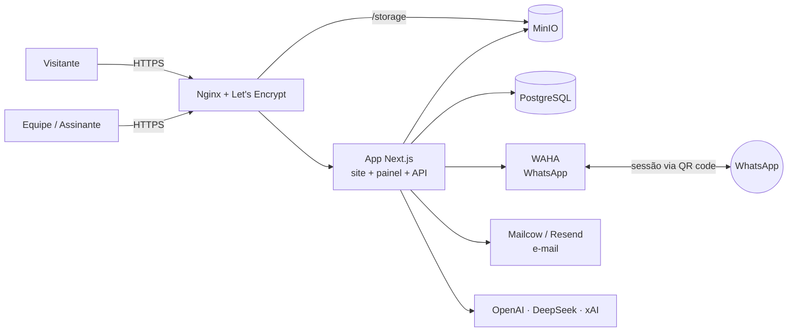
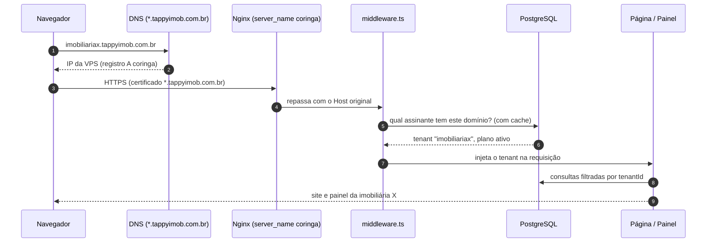
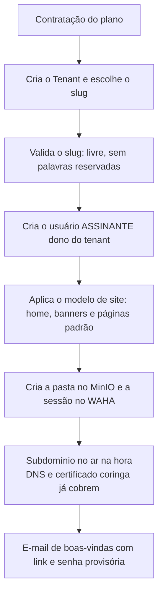

<div align="center">


### CRM imobiliário, portal de imóveis e plataforma SaaS para imobiliárias

Site público · Painel de gestão completo · WhatsApp integrado · IA analista de dados · Multi-site

<br />


</div>

---

## Sumário

1. [Visão geral](#1-visão-geral)
2. [O que o sistema faz](#2-o-que-o-sistema-faz)
3. [Stack](#3-stack)
4. [Arquitetura](#4-arquitetura)
5. [Estrutura do projeto](#5-estrutura-do-projeto)
6. [Rodando localmente](#6-rodando-localmente)
7. [Variáveis de ambiente](#7-variáveis-de-ambiente)
8. [Infraestrutura a contratar e configurar](#8-infraestrutura-a-contratar-e-configurar)
9. [Plataforma SaaS: assinantes com site e painel próprios](#9-plataforma-saas-assinantes-com-site-e-painel-próprios)
10. [Deploy](#10-deploy)
11. [Segurança e LGPD](#11-segurança-e-lgpd)
12. [Roadmap](#12-roadmap)

---

## 1. Visão geral

A **Tappy Imob** é um sistema completo para imobiliárias, em uma única aplicação:

- **Site público** de imóveis, otimizado para Google, com busca, fichas de imóvel, blog, captação de proprietários e formulários que viram leads no CRM.
- **Painel de gestão** (`/admin`) com CRM de leads em kanban, imóveis, corretores, contratos, financeiro, agenda, marketing, armazenamento de arquivos e WhatsApp.
- **Tappy IA**, uma analista que responde perguntas sobre o próprio negócio ("qual imóvel teve mais acessos este mês?", "quem mais vendeu?") consultando o banco em tempo real.
- **Áreas por perfil**: administrador, corretor, SDR, marketing, fotógrafo, parceiro externo e assinante.
- **Base para SaaS**: a estrutura para que cada imobiliária assinante tenha o próprio site e o próprio painel em `assinante.tappyimob.com.br`. Veja o [capítulo 9](#9-plataforma-saas-assinantes-com-site-e-painel-próprios), que separa o que já existe do que falta construir.

---

## 2. O que o sistema faz

### Site público

| Área | Rota | Destaques |
|---|---|---|
| Home | `/` | Destaques, carrosséis por categoria, banners editáveis pelo painel |
| Busca de imóveis | `/imoveis`, `/encontre-seu-imovel` | Filtros por tipo, preço, dormitórios, bairro e condomínio |
| Ficha do imóvel | `/imovel/[slug]` | Galeria, mapa, simulação, WhatsApp com captura de contato, dados estruturados para o Google |
| Condomínios | `/condominios`, `/condominio/[slug]` | Página por condomínio com os imóveis disponíveis |
| Venda e captação | `/vender`, `/gestao-exclusiva`, `/off-market` | Formulários de avaliação e captação que caem direto no CRM |
| Conteúdo | `/blog`, `/sobre`, `/calculadora`, `/regularizacao` | Blog com editor visual, calculadoras, páginas institucionais |
| Parceiros | `/parceiros`, `/cadastro-parceiro`, `/corretor-parceiro` | Cadastro e portal de corretores e imobiliárias parceiras |
| Legal | `/privacidade`, `/termos`, `/cookies` | Políticas exigidas pela LGPD |
| SEO | `sitemap.xml`, `robots.txt` | Sitemap automático de todas as fichas, Open Graph por página |

**Rastreamento de campanhas:** a primeira visita grava UTM, `gclid` e `fbclid` num cookie de 90 dias. Todo lead criado depois carrega a origem da campanha.

### Painel de gestão (`/admin`)

| Módulo | O que faz |
|---|---|
| **Visão geral** | Indicadores do negócio em tempo real |
| **Tappy IA** | Chat e voz com a analista de dados: rankings, contagens e dossiês de imóvel, lead e corretor |
| **Imóveis** | Cadastro completo, captação, exclusividades, imóveis do site, publicação em portais (ZAP, OLX, Imovelweb…) |
| **Clientes (CRM)** | Kanban de leads por etapa, Acervo, Limbo, triagem SDR, importação e exportação em planilha |
| **Leads WhatsApp** | Conversas do WhatsApp dentro do painel, com atualização automática |
| **Corretores e vendedores** | Equipe, metas, comissões, proprietários |
| **Parcerias** | Funil de parceiros externos, propostas e contratos de parceria |
| **Contratos e negócios** | Fechamento com extração por IA, minutas e assinatura |
| **Agenda e agendamentos** | Visitas com Google Calendar, sessões de fotos |
| **Financeiro** | Comissões e metas por corretor |
| **Marketing** | Analytics, insights de público, campanhas, Instagram |
| **Blog e site** | Editor de posts, banners, seções da home e pop-ups |
| **Storage** | Gerenciador de arquivos com pastas e permissões, sobre MinIO |
| **Tappy IQ** | Enriquecimento de dados de leads (Seekloc / PH3A) |
| **Multi-sites** | Parceiros, domínios e permissões (base do SaaS) |
| **Assinantes SaaS** | Assinaturas, Sites, Planos e Configurações (menu criado, páginas em construção) |
| **Usuários** | Perfis, permissões por módulo, ativação |

### Perfis de acesso

| Perfil | Onde entra | Acesso |
|---|---|---|
| `ADMIN` | `/admin` | Tudo, ou só os módulos liberados para ele |
| `SDR` | `/admin` | Triagem e qualificação de leads |
| `MARKETING` | `/admin` | Módulos de marketing e conteúdo |
| `CORRETOR` | `/corretor` | Os próprios leads, imóveis, agenda e propostas |
| `FOTOGRAFO` | `/fotografo` | Sessões de foto atribuídas a ele |
| `PARCEIRO_EXTERNO` | `/parceiro` | Imóveis e leads da parceria |
| `ASSINANTE` | `/` | Perfil do cliente SaaS. A área própria ainda será criada |
| `CLIENTE` | `/` | Favoritos e conta no site |

---

## 3. Stack

| Camada | Tecnologia | Papel |
|---|---|---|
| Framework | **Next.js 16** (App Router, Turbopack) | Site, painel e API no mesmo projeto, saída `standalone` |
| Interface | **React 19**, **Tailwind CSS 4**, Radix UI, Framer Motion | Componentes, tema claro e escuro, animações |
| Linguagem | **TypeScript 5** | Tipagem de ponta a ponta |
| Banco | **PostgreSQL 16** + **Prisma 7** (`@prisma/adapter-pg`) | 123 modelos, schema único em `prisma/schema.prisma` |
| Estado no painel | TanStack React Query 5 | Cache e sincronização das telas do admin |
| Autenticação | JWT próprio com `jose` + `bcryptjs` | Sessão em cookie, perfis e permissões por módulo |
| Arquivos | **MinIO** (compatível com S3), Vercel Blob como alternativa | Fotos de imóveis, documentos, anexos |
| WhatsApp | **WAHA** (API HTTP do WhatsApp, self-hosted) | Conversas no painel e notificações de lead |
| E-mail | **Mailcow** (caixas próprias) + **Resend** (transacional) | E-mails do domínio e envios automáticos |
| IA | OpenAI, DeepSeek, xAI | Tappy IA, extração de documentos, geração de texto e imagem |
| Editor | TipTap | Blog e textos ricos |
| Documentos | docxtemplater, Puppeteer, xlsx | Contratos em Word, PDFs, planilhas |
| Integrações | Google Calendar, Apify (Instagram), portais via XML | Agenda, feed social, exportação de anúncios |
| Infra | Docker Compose, Nginx, Let's Encrypt | Uma VPS roda tudo |

---

## 4. Arquitetura



**Como uma requisição percorre o sistema**

1. O **Nginx** termina o HTTPS. Pedidos para `/storage` vão direto ao MinIO; o resto vai para o app.
2. O `middleware.ts` trata robôs de redes sociais (devolve Open Graph pronto) e o modo manutenção.
3. As **páginas públicas** são Server Components que consultam o banco via Prisma e chegam prontas ao navegador, o que é bom para o Google.
4. O **painel** é client-side: as telas buscam dados em `/api/admin/*` com React Query.
5. As **rotas de API** validam a sessão (`getSession()`), checam perfil e módulo, consultam o Prisma e respondem JSON.

---

## 5. Estrutura do projeto

```
tappyimob/
├── prisma/
│   └── schema.prisma          # Fonte única do banco (123 modelos)
├── public/                    # Logos, favicon, og-image
├── src/
│   ├── app/
│   │   ├── (site público)     # /, /imoveis, /imovel/[slug], /blog, /vender…
│   │   ├── admin/             # Painel: um diretório por módulo
│   │   ├── corretor/          # Área do corretor
│   │   ├── fotografo/         # Área do fotógrafo
│   │   ├── parceiro/          # Área do parceiro externo
│   │   ├── tappy-ia/          # Interface da Tappy IA (chat e voz)
│   │   └── api/               # Rotas de API (admin, leads, webhooks, cron…)
│   ├── components/            # Componentes do site, do painel e base de UI
│   ├── lib/                   # Auth, Prisma, MinIO, WAHA, e-mail, IA, utilitários
│   ├── providers/             # Contextos React (auth, tema, React Query)
│   └── hooks/                 # Hooks compartilhados
├── nginx/                     # Configuração do proxy reverso
├── docker-compose.prod.yml    # App + PostgreSQL + MinIO
└── Dockerfile                 # Build multi-stage (Node 20, pnpm 10.15.1)
```

---

## 6. Rodando localmente

**Pré-requisitos:** Node 20 ou superior, pnpm 10 e um PostgreSQL (local, Docker ou Neon).

```bash
pnpm install                 # instala e gera o cliente Prisma
touch .env                   # preencha as variáveis do capítulo 7
pnpm db:push                 # cria as tabelas no banco vazio
pnpm dev                     # http://localhost:3000
```

| Comando | O que faz |
|---|---|
| `pnpm dev` | Servidor de desenvolvimento |
| `pnpm build` | Gera o Prisma e compila para produção |
| `pnpm start` | Sobe a versão compilada |
| `pnpm db:push` | Aplica o `schema.prisma` no banco |
| `pnpm db:studio` | Abre o Prisma Studio para ver os dados |
| `pnpm lint` | ESLint |

> ⚠️ **`db:push` aplica o schema no banco do `DATABASE_URL`.** Confira sempre para qual banco o `.env` aponta antes de rodar. Nunca use `prisma migrate reset` em produção: ele apaga todos os dados.

---

## 7. Variáveis de ambiente

Nenhum segredo fica no código. Tudo vem do `.env` (local) ou do ambiente do container (produção).

### Essenciais

| Variável | Para que serve |
|---|---|
| `DATABASE_URL` | Conexão PostgreSQL |
| `JWT_SECRET` | Assinatura das sessões. Use 64+ caracteres aleatórios |
| `NEXTAUTH_URL`, `NEXT_PUBLIC_APP_URL`, `NEXT_PUBLIC_BASE_URL` | URL pública do site (`https://tappyimob.com.br`) |
| `CRON_SECRET` | Protege as rotas de tarefas agendadas |
| `ADMIN_SECRET_TOKEN` | Rotas administrativas internas |

### Armazenamento (MinIO)

| Variável | Para que serve |
|---|---|
| `MINIO_ENDPOINT` | Endereço interno (`http://minio:9000` no Docker) |
| `MINIO_ROOT_USER`, `MINIO_ROOT_PASSWORD` | Credenciais do MinIO |
| `MINIO_BUCKET` | Bucket principal (ex.: `tappyimob-storage`) |
| `MINIO_PUBLIC_URL` | URL pública dos arquivos (`https://tappyimob.com.br/storage`). Também libera o host das imagens no `next.config.ts` |
| `MINIO_PUBLIC_HOST`, `MINIO_PUBLIC_PORT`, `MINIO_PUBLIC_SSL` | Montagem de URLs assinadas |
| `BLOB_READ_WRITE_TOKEN` | Vercel Blob, alternativa ao MinIO (opcional) |

### WhatsApp (WAHA)

| Variável | Para que serve |
|---|---|
| `WAHA_API_URL` | Endereço do WAHA (`http://waha:3000` na rede Docker) |
| `WAHA_API_KEY` | Chave da API do WAHA |
| `WAHA_DEFAULT_SESSION` | Sessão que envia as notificações de lead |
| `WAHA_SESSION_PREFIX`, `WAHA_ALLOWED_SESSIONS` | Isolamento quando o WAHA é compartilhado |
| `LEAD_NOTIFY_PHONES` | Telefones extras que recebem aviso de lead novo |
| `NEXT_PUBLIC_SALES_WHATSAPP` | Número do botão de WhatsApp do site |

### E-mail

| Variável | Para que serve |
|---|---|
| `MAILCOW_API_URL`, `MAILCOW_API_KEY` | Criação e gestão de caixas de e-mail pelo painel |
| `SMTP_HOST`, `SMTP_EVENTO_PASSWORD` | Envio via SMTP próprio |
| `RESEND_API_KEY` | E-mails transacionais (recuperação de senha, avisos) |

### Inteligência artificial

| Variável | Para que serve |
|---|---|
| `OPENAI_API_KEY` | Tappy IA, voz, imagens e extração de documentos |
| `TAPPY_IA_MODEL` | Modelo de texto da Tappy IA (padrão `gpt-5.4-mini`) |
| `OPENAI_EXTRACTION_MODEL` | Modelo de leitura de documentos |
| `DEEPSEEK_API_KEY`, `DEEPSEEK_API_BASE_URL`, `DEEPSEEK_MODEL` | Provedor alternativo, mais barato |
| `XAI_API_KEY` | Grok (xAI) |

### Integrações opcionais

| Variável | Para que serve |
|---|---|
| `GOOGLE_CLIENT_ID`, `GOOGLE_CLIENT_SECRET`, `GOOGLE_REDIRECT_URI` | Google Calendar das visitas |
| `APIFY_API_TOKEN`, `APIFY_INSTAGRAM_ACTOR_ID` | Feed do Instagram no site |
| `LEAD_WEBHOOK_URL` | Envia cada lead para Make, Zapier ou planilha |
| `PORTAL_EXPORT_TOKEN` | Protege o XML de imóveis lido pelos portais |
| `SEEKLOC_*`, `PH3A_*`, `TAPPY_IQ_CACHE_DAYS` | Enriquecimento de dados (Tappy IQ) |
| `PUPPETEER_EXECUTABLE_PATH` | Chromium para gerar PDFs |

---

## 8. Infraestrutura a contratar e configurar

Tudo roda em **uma VPS** com Docker. Abaixo, o que contratar, por que e como configurar cada peça.

### 8.1 VPS

| Item | Recomendação |
|---|---|
| Sistema | Ubuntu 24.04 LTS |
| Começo | 4 vCPU · 8 GB RAM · 160 GB SSD (app, banco, MinIO e WAHA) |
| Com Mailcow e assinantes | 8 vCPU · 16 GB RAM · 300 GB+ SSD |
| Provedores | Vultr, Hetzner, DigitalOcean, Contabo, Hostinger VPS |

```bash
# na VPS
apt update && apt upgrade -y
curl -fsSL https://get.docker.com | sh
apt install -y nginx certbot python3-certbot-nginx
ufw allow OpenSSH && ufw allow 80 && ufw allow 443 && ufw enable
```

> Use chave SSH, desative o login por senha do root e não exponha as portas do banco (5432), do MinIO (9000/9001) e do WAHA à internet. Só o Nginx deve ficar público.

### 8.2 Domínio e DNS

No registrador do domínio (Registro.br, Cloudflare…):

| Tipo | Nome | Valor | Para quê |
|---|---|---|---|
| A | `@` | IP da VPS | `tappyimob.com.br` |
| A | `www` | IP da VPS | `www.tappyimob.com.br` |
| A | `*` | IP da VPS | **Subdomínios dos assinantes** (capítulo 9) |
| A | `mail` | IP da VPS (ou do servidor de e-mail) | Mailcow |
| MX | `@` | `mail.tappyimob.com.br` (prioridade 10) | Receber e-mails |
| TXT | `@` | `v=spf1 mx -all` | SPF |
| TXT | `dkim._domainkey` | gerado pelo Mailcow | DKIM |
| TXT | `_dmarc` | `v=DMARC1; p=quarantine; rua=mailto:dmarc@tappyimob.com.br` | DMARC |

> Recomendado: usar a **Cloudflare como DNS**. Ela facilita o certificado coringa (`*.tappyimob.com.br`) e o cadastro automático de domínios próprios dos assinantes.

### 8.3 PostgreSQL

Duas opções:

**A) No próprio Docker da VPS** (já vem no `docker-compose.prod.yml`): custo zero além da VPS. Você cuida do backup.

```bash
# backup diário (crontab da VPS)
0 3 * * * docker exec tappyimob-postgres pg_dump -U tappyimob tappyimob | gzip > /backups/db-$(date +\%F).sql.gz
```

**B) Gerenciado** (Neon, Supabase, RDS): backups, réplicas e restauração em um clique. Basta trocar o `DATABASE_URL`.

Em qualquer opção:
- usuário próprio do app, sem ser superusuário;
- senha forte;
- **backup testado**: restaurar de vez em quando num banco de teste para garantir que funciona;
- depois de criar o banco: `pnpm db:push`.

### 8.4 MinIO (fotos e arquivos)

Já vem no `docker-compose.prod.yml`. Configuração:

1. Defina `MINIO_ROOT_USER` e `MINIO_ROOT_PASSWORD` fortes no `.env`.
2. Crie o bucket (`MINIO_BUCKET`, padrão `tappyimob-storage`) pelo console do MinIO (porta 9001, só via túnel SSH) ou com `mc mb`.
3. Política de leitura pública **apenas** para as pastas de imagens do site (`properties/`, `site/`, `blog/`). Documentos e contratos ficam privados e saem por link assinado.
4. O Nginx publica o MinIO em `https://tappyimob.com.br/storage/` (veja `nginx/tappyimob.conf`).
5. `MINIO_PUBLIC_URL=https://tappyimob.com.br/storage`.

> Para muito volume, dá para trocar o MinIO por Cloudflare R2, Backblaze B2 ou AWS S3, que são compatíveis com S3, mudando só as variáveis.

### 8.5 WhatsApp (WAHA)

O WAHA mantém o WhatsApp conectado como um WhatsApp Web, controlado por API.

```yaml
# /home/waha/docker-compose.yml
services:
  waha:
    image: devlikeapro/waha:latest       # gratuito; o antigo "Plus" agora é a imagem padrão
    container_name: waha
    restart: unless-stopped
    ports: ["127.0.0.1:9011:3000"]       # só local; o app fala pela rede Docker
    volumes: ["./sessions:/app/.sessions"]
    environment:
      - WHATSAPP_DEFAULT_ENGINE=GOWS     # sem navegador: mais leve e estável
      - WAHA_API_KEY=<chave forte>
      - WAHA_DASHBOARD_ENABLED=true
      - TZ=America/Sao_Paulo
    networks: [app-network]
```

1. Suba o container e coloque o mesmo `WAHA_API_KEY` no `.env` do app.
2. No painel, em **Leads WhatsApp**, crie a sessão e leia o QR code com o celular.
3. A sessão `WAHA_DEFAULT_SESSION` envia as notificações de lead novo.

> ⚠️ O WAHA é uma API **não oficial**: o WhatsApp não autoriza automações, e o número pode ser banido. Atender clientes tem risco baixo; **disparo em massa tem risco alto**. Para risco zero, use a **API oficial da Meta (WhatsApp Cloud API)**, que é cobrada por conversa iniciada pela empresa.
>
> Para vários assinantes, use **uma sessão por assinante** e **chaves por sessão** (`POST /api/keys` do WAHA): cada site só enxerga o próprio WhatsApp.

### 8.6 E-mail (Mailcow + Resend)

**Mailcow** cria as caixas `@tappyimob.com.br` (contato, comercial, corretores) e é gerenciado pelo painel.

```bash
cd /opt && git clone https://github.com/mailcow/mailcow-dockerized && cd mailcow-dockerized
./generate_config.sh          # informe mail.tappyimob.com.br
docker compose up -d
```

1. Ajuste os registros MX, SPF, DKIM e DMARC (item 8.2). O DKIM aparece em *Configuration → ARC/DKIM keys*.
2. Configure o **PTR (DNS reverso)** do IP da VPS para `mail.tappyimob.com.br` no painel do provedor. Sem isso, os e-mails vão para o spam.
3. Gere uma chave em *Configuration → Access → API* e coloque em `MAILCOW_API_URL` e `MAILCOW_API_KEY`.
4. Confirme que o provedor da VPS libera a **porta 25**. Muitos bloqueiam por padrão.

> O Mailcow precisa de **6 GB de RAM** só para ele. Se a VPS for pequena, use um servidor separado ou um serviço pronto (Zoho Mail, Google Workspace) e mantenha só o **Resend** para os envios automáticos.

**Resend** cuida dos envios transacionais: crie a conta, valide o domínio pelos registros DNS que ele mostrar e coloque o `RESEND_API_KEY`.

### 8.7 Nginx e HTTPS

```bash
cp nginx/tappyimob.conf /etc/nginx/sites-available/
ln -s /etc/nginx/sites-available/tappyimob.conf /etc/nginx/sites-enabled/
nginx -t && systemctl reload nginx
certbot --nginx -d tappyimob.com.br -d www.tappyimob.com.br
```

O certificado coringa para os assinantes está no [capítulo 9](#94-certificado-coringa).

### 8.8 Contas de serviços

| Serviço | Necessário? | Onde |
|---|---|---|
| OpenAI | Sim, para a Tappy IA | platform.openai.com: chave de API e **créditos pré-pagos** |
| DeepSeek / xAI | Opcional | Alternativas mais baratas |
| Google Cloud | Opcional | OAuth para o Google Calendar |
| Apify | Opcional | Feed do Instagram |
| Cloudflare | Recomendado | DNS, certificado coringa e domínios dos assinantes |

> Acompanhe o saldo da OpenAI. Sem créditos, a Tappy IA para de responder.

---

## 9. Plataforma SaaS: assinantes com site e painel próprios

### 9.1 A visão

Cada imobiliária assinante recebe:

- **um site próprio** em `nomedaimobiliaria.tappyimob.com.br`, com a **home `/` dela**, os imóveis dela, banners, cores e logo dela;
- **um painel próprio**, igual ao `/admin` da Tappy Imob, para gerenciar imóveis, leads, corretores, WhatsApp e site;
- opcionalmente, **o próprio domínio** (`www.imobiliariax.com.br`) apontando para o mesmo site;
- um **plano** com limites (imóveis, usuários, sessões de WhatsApp, armazenamento) e cobrança recorrente.

E o administrador da Tappy Imob gerencia tudo em **Assinantes SaaS**: Assinaturas, Sites, Planos e Configurações.

### 9.2 O que já existe e o que falta

| Peça | Status |
|---|---|
| Menu **Assinantes SaaS** (Assinaturas, Sites, Planos, Configurações) | ✅ Criado. Páginas a construir |
| Perfil de usuário `ASSINANTE` | ✅ Criado. Área própria a construir |
| Modelos `Partner`, `PartnerDomain`, `PartnerPermission` (domínio, SSL, DNS por parceiro) | ✅ Existem no banco. Base reaproveitável |
| Identificar o assinante pelo endereço acessado (`middleware.ts`) | ⏳ A construir |
| Separar os dados por assinante (`tenantId` nas tabelas) | ⏳ A construir |
| Planos, assinaturas e cobrança | ⏳ A construir |
| Criação automática de subdomínio e certificado | ⏳ A construir |

> **Importante:** hoje o sistema funciona para **uma imobiliária**. Imóveis, leads e usuários não têm um campo que diga a qual assinante pertencem. Ligar o subdomínio sem separar os dados faria um assinante ver os dados de outro. A separação (item 9.5) é a primeira coisa a construir.

### 9.3 Como o subdomínio vai funcionar



Um **único** app Next.js atende todos os assinantes. Não é preciso subir um container por cliente: o endereço acessado decide de quem é o site.

### 9.4 Certificado coringa

Um certificado `*.tappyimob.com.br` cobre todos os subdomínios. Ele exige validação por DNS:

```bash
# com a Cloudflare como DNS
apt install -y python3-certbot-dns-cloudflare
cat > /root/.cloudflare.ini <<'EOF'
dns_cloudflare_api_token = <token com permissão Zone:DNS:Edit>
EOF
chmod 600 /root/.cloudflare.ini
certbot certonly --dns-cloudflare --dns-cloudflare-credentials /root/.cloudflare.ini \
  -d "tappyimob.com.br" -d "*.tappyimob.com.br"
```

A renovação é automática. Bloco do Nginx que atende todos os assinantes:

```nginx
server {
    listen 443 ssl http2;
    server_name ~^(?<assinante>[a-z0-9-]+)\.tappyimob\.com\.br$;

    ssl_certificate     /etc/letsencrypt/live/tappyimob.com.br/fullchain.pem;
    ssl_certificate_key /etc/letsencrypt/live/tappyimob.com.br/privkey.pem;

    location /storage/ { proxy_pass http://127.0.0.1:9000/; }
    location / {
        proxy_pass http://127.0.0.1:3000;
        proxy_set_header Host $host;                 # o app lê o assinante daqui
        proxy_set_header X-Forwarded-Proto $scheme;
        proxy_set_header X-Real-IP $remote_addr;
    }
}
```

**Domínio próprio do assinante** (`www.imobiliariax.com.br`): o assinante cria um `CNAME` para `sites.tappyimob.com.br`, e o certificado é emitido sob demanda. A forma mais simples é o **Caddy** com *on-demand TLS* (ele emite o certificado no primeiro acesso, depois de perguntar ao app se o domínio está cadastrado) ou o **Cloudflare for SaaS (Custom Hostnames)**.

### 9.5 Separação dos dados por assinante

Recomendação: **um banco com `tenantId`** em todas as tabelas de negócio. É o modelo mais barato e simples de manter.

```prisma
model Tenant {
  id         String   @id @default(cuid())
  slug       String   @unique          // imobiliariax → imobiliariax.tappyimob.com.br
  nome       String
  status     String   @default("TRIAL") // TRIAL | ATIVO | INADIMPLENTE | CANCELADO
  planoId    String?
  marca      Json?                      // logo, cores, textos da home
  dominios   PartnerDomain[]
  createdAt  DateTime @default(now())
}

model Property {
  // …campos atuais…
  tenantId String
  tenant   Tenant @relation(fields: [tenantId], references: [id])
  @@index([tenantId])
}
```

1. Criar o modelo `Tenant` e transformar a Tappy Imob no **tenant nº 1**, com todos os dados atuais.
2. Incluir `tenantId` em imóveis, leads, usuários, contratos, arquivos, posts, configurações do site e demais tabelas de negócio.
3. Aplicar o filtro de forma **automática**, com uma extensão do Prisma Client (`$extends`) que injeta `where: { tenantId }` em toda consulta. Assim ninguém esquece um filtro em uma rota.
4. Opcional e mais forte: **Row-Level Security** no PostgreSQL, que barra o vazamento no próprio banco.
5. Isolar também o resto da infra:
   - **MinIO:** pasta por assinante (`tenants/<slug>/…`);
   - **WAHA:** sessão e chave por assinante;
   - **e-mail:** remetente e domínio por assinante;
   - **cache e sitemap:** separados por domínio.

> **Alternativa:** um banco por assinante. O isolamento é máximo, mas a operação é muito mais pesada (migrações em N bancos, backups e conexões multiplicados). Só compensa para clientes grandes que exigem isso em contrato.

### 9.6 Provisionamento automático de um assinante

Quando um assinante contrata, em **Assinantes SaaS → Assinaturas → Novo**:



Com o DNS e o certificado coringa, o subdomínio **não exige nenhuma ação na VPS**: basta criar o tenant no banco. Só o domínio próprio do assinante passa por verificação de DNS e emissão de certificado, que podem ser automatizadas (item 9.4).

**Slugs reservados** (não podem ser usados por assinantes): `www`, `admin`, `api`, `app`, `mail`, `smtp`, `storage`, `sites`, `status`, `blog`, `ajuda`.

### 9.7 Planos e cobrança

| Peça | Sugestão |
|---|---|
| Gateway | **Asaas**, **Pagar.me** ou **Stripe** (assinatura recorrente, Pix, boleto e cartão) |
| Fluxo | Checkout → webhook do gateway → assinatura ativa → tenant liberado |
| Inadimplência | Aviso por e-mail e WhatsApp → período de carência → painel em modo leitura → site suspenso |
| Limites por plano | Imóveis, usuários, sessões de WhatsApp, armazenamento, uso de IA |
| Página de planos | Seção de planos na home da Tappy Imob, ligada ao checkout |

### 9.8 O que cada assinante gerencia

O painel do assinante é o mesmo `/admin`, filtrado pelo tenant e pelos limites do plano:

- **Site:** logo, cores, banners da home, páginas, pop-ups e domínio próprio;
- **Imóveis:** cadastro, fotos, destaques e publicação em portais;
- **CRM:** leads, kanban, corretores e agenda;
- **WhatsApp:** a própria sessão e os atendimentos;
- **Usuários:** a própria equipe, dentro do limite do plano.

Ficam **só com o administrador da Tappy Imob**: Assinantes SaaS, Planos, Configurações globais, Multi-sites e as integrações da plataforma.

---

## 10. Deploy

```bash
# na VPS, dentro da pasta do projeto
git pull
docker compose -f docker-compose.prod.yml up -d --build
```

O `docker-compose.prod.yml` sobe **app** (`tappyimob-app`), **PostgreSQL** (`tappyimob-postgres`) e **MinIO** (`tappyimob-minio`) na mesma rede. Se a VPS já roda outra instância do sistema, troque os nomes dos containers para não colidirem. WAHA e Mailcow rodam em composes próprios, ligados a essa rede.

Depois de cada deploy, vale "aquecer" o otimizador de imagens, para que o primeiro visitante não pegue uma página lenta:

```bash
curl -s https://tappyimob.com.br/ -o /dev/null
```

| Checagem | Como |
|---|---|
| App no ar | `curl -I https://tappyimob.com.br` → 200 |
| Saúde | `GET /api/health` |
| Logs | `docker logs -f tappyimob-app` |
| Banco | `docker exec -it tappyimob-postgres psql -U tappyimob tappyimob` |

---

## 11. Segurança e LGPD

- **Segredos só no `.env`**, nunca no código ou em documentos versionados. Troque todas as chaves ao entregar a um novo responsável.
- **Senhas** guardadas com bcrypt. Sessões em cookie assinado (JWT) com validade de 7 dias.
- **Permissões por módulo**: cada administrador pode ser limitado a módulos específicos.
- **Dados pessoais** (telefone, e-mail, CPF de leads e proprietários): acesso restrito por perfil, exportação só para administradores, política de privacidade publicada.
- **Multi-tenant:** isolamento por `tenantId` aplicado no ORM e, de preferência, também no banco (RLS). Teste de vazamento entre tenants antes de abrir para clientes.
- **Backups** diários do banco e do MinIO, guardados fora da VPS.
- **WhatsApp:** respeitar o opt-out e evitar disparo em massa.

---

## 12. Roadmap

**Plataforma SaaS**
- [ ] Modelo `Tenant` e `tenantId` nas tabelas de negócio
- [ ] Extensão do Prisma que aplica o filtro de tenant automaticamente
- [ ] `middleware.ts` resolvendo o tenant pelo domínio acessado
- [ ] DNS coringa e certificado `*.tappyimob.com.br`
- [ ] Páginas **Assinaturas**, **Sites**, **Planos** e **Configurações**
- [ ] Integração com gateway de pagamento e webhooks
- [ ] Área do perfil `ASSINANTE`
- [ ] Domínio próprio do assinante com certificado sob demanda
- [ ] Seção de planos na home

**Produto**
- [ ] Definir a cidade e a região padrão nos textos de SEO (hoje com o marcador "Sua Cidade")
- [ ] `.env.example` completo, sem valores
- [ ] Seed inicial: administrador, configurações do site e páginas padrão

---

<div align="center">


**Tappy Imob** · Tecnologia para imobiliárias que querem vender mais

</div>
